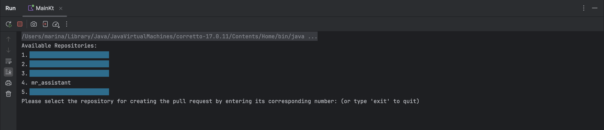
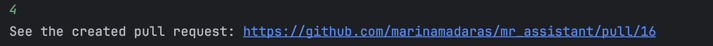
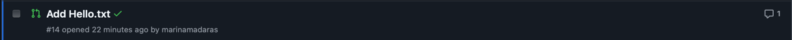
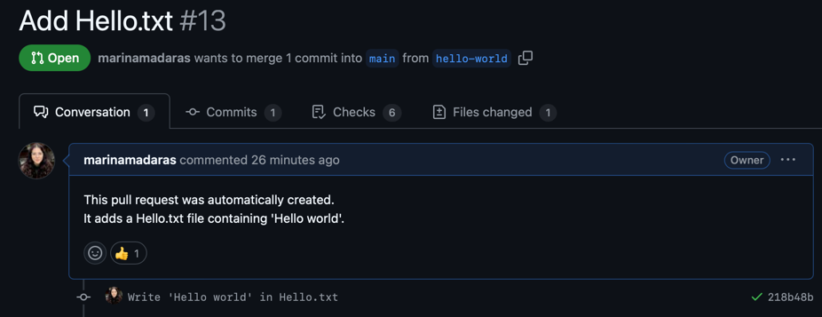

# Automatic "Hello World" pull request creation

## Description
This is a simple Kotlin application that creates a pull request in a private GitHub account
with "Hello World" written in "Hello.txt" file.

## How to install
1. Clone this repository
2. Open the project in IntelliJ IDEA
3. Copy the [github.properties.template](src/main/resources/github.properties.template) file to `src/main/resources/github.properties`
4. Fill in the `github.properties` file with your _GitHub Personal access token_ (see below how to get it).
### How to get a GitHub Personal Access Token
1. Go to your [personal access tokens](https://github.com/settings/tokens) in your GitHub account.
2. Click on `Generate new token`
3. Allow all the permissions
4. Copy the generated token and paste it in the `github.properties` file
---
## How to run
1. Run the `Main.kt` file
2. The CLI will prompt you with a list of repositories in your GitHub account

3. Type the number of the repository where you want to create the pull request

4. Check your GitHub account for the new pull request

### How to verify
1. Go to your GitHub account
2. Go to the repository where you want to create the pull request
3. You should see a new pull request with "Hello World" in the `Hello.txt` file

